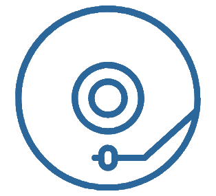

    

<h1 align="center">Taste Lynx</h1>

Automagically recieve new releases from your favorite spotify artists.

## Features

- See artist suggestions based on your spotify preferences
- Search for and save your favorite artists
- Get new releases sent to a custom Spotify playlist every day

## Tools / Technologies used

- [Next.js](https://nextjs.org/)
- [React](https://reactjs.org)
- [MongoDB](https://www.mongodb.com)
- [Next Auth](https://next-auth.js.org/) for spotify authentication
- [Chakra UI](https://chakra-ui.com/)

## Already setup

- [x] Authentication + refresh tokens
- [x] Db storage
- [x] Spotify api access
- [x] Save artists
- [x] Remove saved artists
- [x] Trigger playlist update with most recent tracks
- [x] Design homepage
- [x] Cron job to check for releases every day

## Todo

- [ ] Search for artists
- [ ] General UI improvements
- [ ] Make dashboard responsive

## How to run locally

To run taste lynx locally, clone the repository, move to the root directory, and run:

`yarn install`

`yarn dev`

To work correctly, this project requires a .env file. A sample file has been provided as sample.env.

In the root directory create a file ".env" with the following variables:

- Database: You can use a free Atlas mongoDB database for testing purposes
  - DB_URI
- Spotify API: Keys can be generated by creating a spotify app
  - SPOTIFY_CLIENT_ID
  - SPOTIFY_CLIENT_SECRET
- Auth: You need to point nextAuth to the base url of your local server
  - NEXTAUTH_URL

## Disclaimer

Taste Lynx is not responsible for any loss of data resulting from user or system error

## Credit

Created by [Gideon Shils](gideonshils.com)
